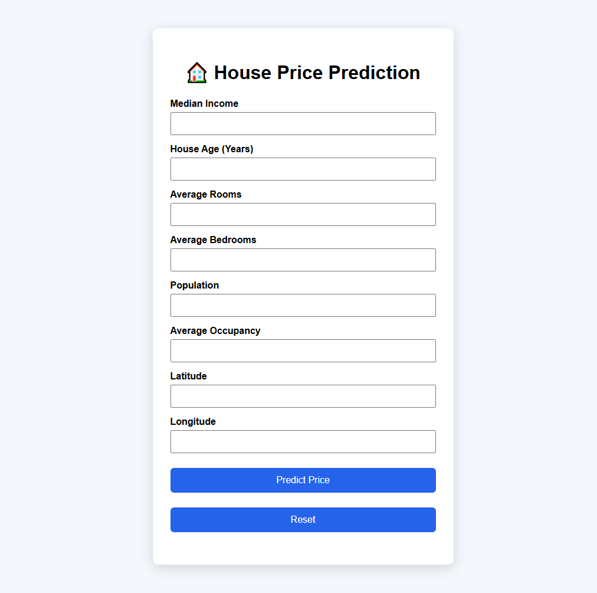
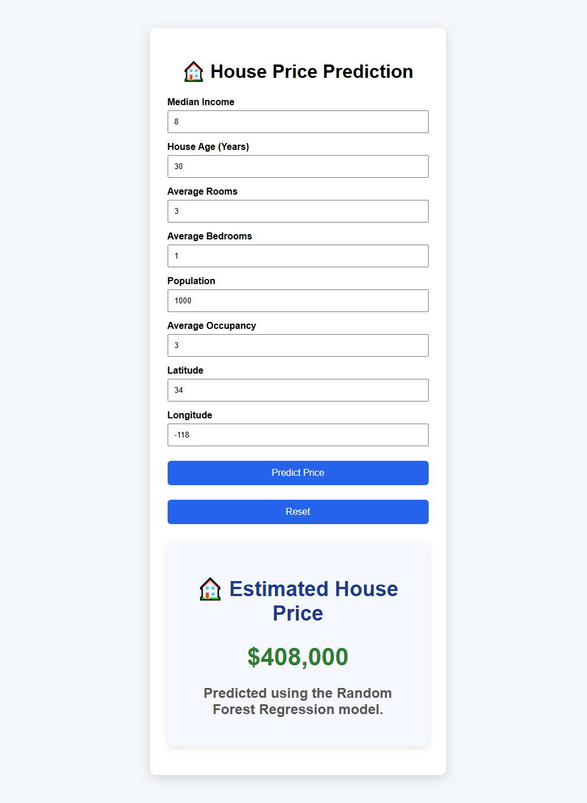
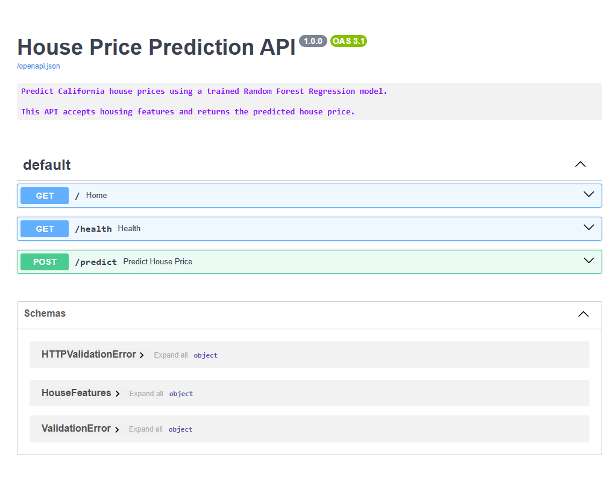

# 🏠 House Price Prediction


A full-stack Machine Learning web application that predicts California house prices using a **Random Forest Regression** model. The application features a responsive web interface, a FastAPI backend, and is fully deployed on Render.

---

## 🌐 Live Demo

### Frontend

https://house-price-predictor-ui-xk1f.onrender.com

### Backend API

https://housepriceprediction-lyyr.onrender.com

### Swagger Documentation

https://housepriceprediction-lyyr.onrender.com/docs

---

## 📸 Screenshots

### 🏠 Home Page



---

### 📈 Prediction Result



---

### 📚 API Documentation



---

## 📑 Table of Contents

- [Project Overview](#-project-overview)
- [Features](#-features)
- [System Architecture](#-system-architecture)
- [Machine Learning Pipeline](#-machine-learning-pipeline)
- [Technology Stack](#-technology-stack)
- [Project Structure](#-project-structure)
- [Dataset](#-dataset)
- [Model Performance](#-model-performance)
- [Installation](#-installation)
- [Running the Project](#-running-the-project)
- [API Endpoints](#-api-endpoints)
- [Example Request](#-example-request)
- [Example Response](#-example-response)
- [Future Improvements](#-future-improvements)
- [Author](#-author)
- [License](#-license)

---

## 📖 Project Overview

This project predicts California house prices using a Machine Learning model trained on the California Housing Dataset from Scikit-learn.

The backend is built with **FastAPI**, which exposes REST API endpoints for prediction. The frontend is built using **HTML, CSS and vanilla JavaScript**, allowing users to enter housing features and instantly receive a predicted house price.

The project demonstrates an end-to-end Machine Learning workflow including:

- Data loading
- Model training
- Model serialization
- REST API development
- Frontend integration
- Cloud deployment

---

## ✨ Features

- 🤖 Predict California house prices using Random Forest Regression
- 🌐 Responsive frontend built with HTML, CSS and JavaScript
- ⚡ REST API built with FastAPI
- ✅ Input validation using Pydantic
- 📄 Interactive Swagger API documentation
- 🛡️ Error handling and structured logging
- 💾 Automatic model loading
- ☁️ Fully deployed on Render
- 🔄 Frontend connected to deployed backend API

---

## 🏗️ System Architecture

```
                User
                  │
                  ▼
      HTML / CSS / JavaScript
             (Frontend)
                  │
          POST /predict
                  │
                  ▼
           FastAPI Backend
                  │
                  ▼
     Random Forest Regressor
                  │
                  ▼
        Predicted House Price
                  │
                  ▼
         Displayed on Frontend
```

---

## 🧠 Machine Learning Pipeline

```
California Housing Dataset
            │
            ▼
      Data Preparation
            │
            ▼
     Train/Test Split
            │
            ▼
Random Forest Regressor
            │
            ▼
      Model Evaluation
            │
            ▼
   Save Model (Joblib)
            │
            ▼
     FastAPI Prediction API
            │
            ▼
      Frontend Application
```

---

## 🛠️ Technology Stack

### Machine Learning

- Scikit-learn
- Pandas
- NumPy
- Joblib

### Backend

- FastAPI
- Uvicorn
- Pydantic

### Frontend

- HTML5
- CSS3
- JavaScript

### Deployment

- Render

### Version Control

- Git
- GitHub

---

## 📂 Project Structure

```
HousePricePrediction/
│
├── data/
├── frontend/
│   ├── index.html
│   ├── style.css
│   └── script.js
│
├── models/
│   └── house_price_model.pkl
│
├── notebooks/
│
├── screenshots/
│   ├── frontend.png
│   ├── prediction.png
│   └── swagger.png
│
├── src/
│   ├── api.py
│   ├── logger.py
│   ├── model_loader.py
│   ├── predict.py
│   ├── schemas.py
│   ├── train.py
│   └── utils.py
│
├── requirements.txt
├── render.yaml
├── runtime.txt
├── README.md
└── LICENSE
```

---

## 📊 Dataset

The project uses the **California Housing Dataset** provided by Scikit-learn.

### Features

- Median Income
- House Age
- Average Rooms
- Average Bedrooms
- Population
- Average Occupancy
- Latitude
- Longitude

### Target

Median House Value

---

## 📈 Model Performance

### Model

Random Forest Regressor

### Evaluation Metric

Mean Absolute Error (MAE)

### Result

```
MAE ≈ 0.328
```

The model predicts California house prices with an average absolute error of approximately 0.328 in the dataset's target units. Lower MAE indicates better prediction accuracy.

---

## 🚀 Installation

Clone the repository

```bash
git clone https://github.com/Faizur-Rahman99/HousePricePrediction.git
```

Move into the project directory

```bash
cd HousePricePrediction
```

Create a virtual environment

```bash
python -m venv venv
```

Activate it

Windows

```bash
.venv\Scripts\activate
```

Install dependencies

```bash
pip install -r requirements.txt
```

---

## ▶ Running the Project

Start the FastAPI server

```bash
uvicorn src.api:app --reload
```

Backend

```
http://127.0.0.1:8000
```

Swagger Documentation

```
http://127.0.0.1:8000/docs
```

To run the frontend locally

```bash
cd frontend
python -m http.server 8000
```

Open

```
http://localhost:8000
```

---

## 📡 API Endpoints

| Method | Endpoint | Description |
|---------|----------|-------------|
| GET | / | Home endpoint |
| GET | /health | Health check |
| POST | /predict | Predict house price |

---

## 📤 Example Request

```json
{
  "MedInc": 8.5,
  "HouseAge": 35,
  "AveRooms": 6.2,
  "AveBedrms": 1.1,
  "Population": 1200,
  "AveOccup": 3.2,
  "Latitude": 34.05,
  "Longitude": -118.25
}
```

---

## 📥 Example Response

```json
{
  "predicted_price": 4.82,
  "currency": "USD",
  "unit": "Hundreds of thousands of dollars",
  "model": "Random Forest Regressor"
}
```

---

## 🎯 Future Improvements

- [ ] Containerize the application using Docker
- [ ] Add automated unit tests with Pytest
- [ ] Configure CI/CD using GitHub Actions
- [ ] Compare multiple regression models
- [ ] Add feature importance visualization
- [ ] Store prediction history in a database
- [ ] Implement user authentication
- [ ] Build an interactive analytics dashboard
- [ ] Retrain the model using updated datasets
---

## 👨‍💻 Author

**Faizur Rahman**

GitHub: https://github.com/Faizur-Rahman99

LinkedIn: *www.linkedin.com/in/faizur-rahman99*

---

## 📄 License

This project is licensed under the MIT License.

See the **LICENSE** file for details.